# PersonalCommerceBankTeamProject

Note: 
Group project sponsored by commerce bank to build an application to store, view, edit, and delete whitelisted IP Addresses.
Team consisted of 5 people including me and included building, progress check-in's, and a final presentation.

Project Details: 
platform seamlessly integrates with an H2 Database, Using Spring Boot, Java 17, and React to ensure compatibility and flexibility. 
Providing an easy to use  interface for recording, monitoring, and administering IP addresses by Application ID and Server. 
With a wide range of features like comprehensive table views, individual IP inspection, and efficient search and sorting capabilities, 
users can manage IP records effortlessly. For security, role-based access control ensures appropriate permissions, 
with administrators overseeing CRUD operations and user management, while users focus on server information for their assigned Application IDs.

To run:
Open intellij for project and run the "main" CommerceBankTeamProjectApplication

Open VS code for project and open integrated terminal for react-front-end
    -npm install 
    -npm run dev
    -control + click link

Or

Open project in VS Code and run the "main" CommerceBankTeamProjectApplication

right click react-front-end folder and open integrated terminal and run commands
    -npm install 
    -npm run dev
    -control + click link

Admin login:
User: 'admin'
password: 'commercebank'

Regular User Login:
User: 'user'
password: 'commercebank'

Login Page:
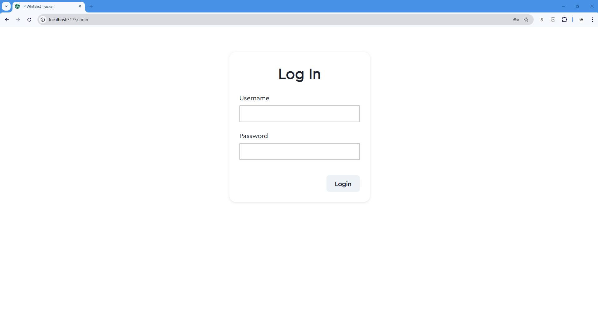
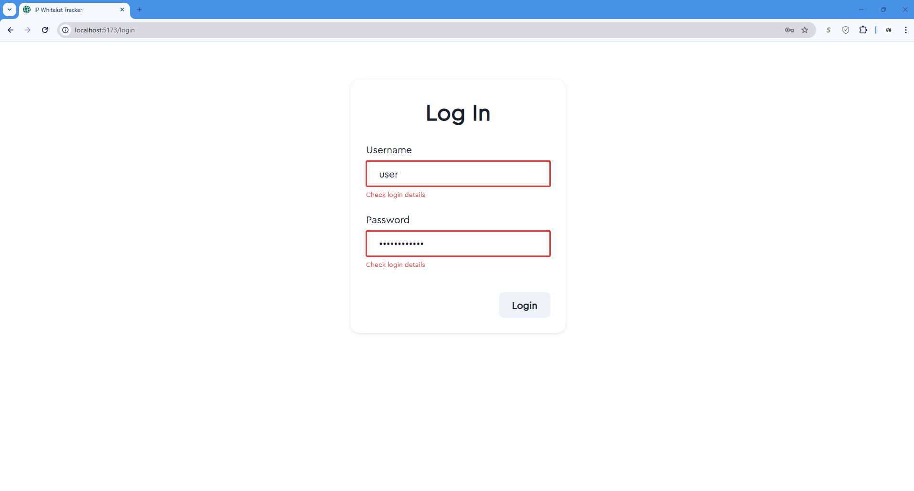

Admin View:
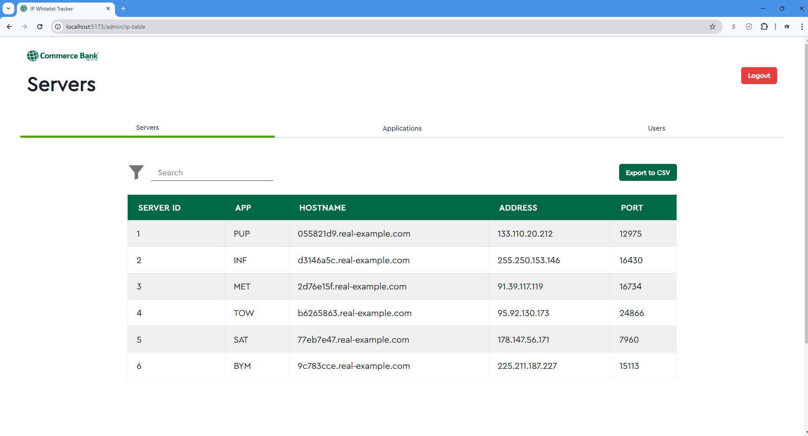
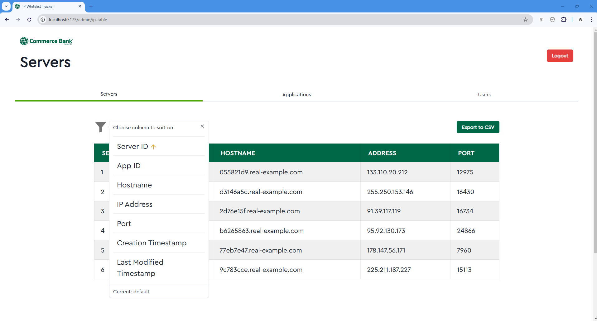
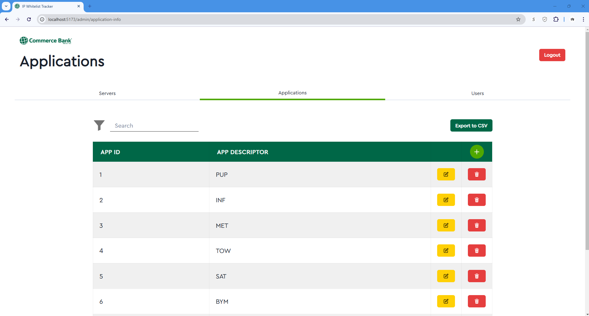
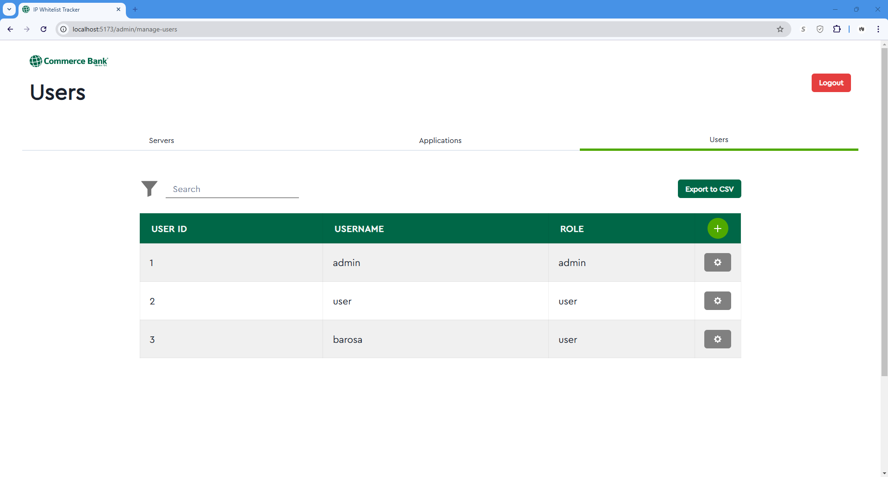

User View:
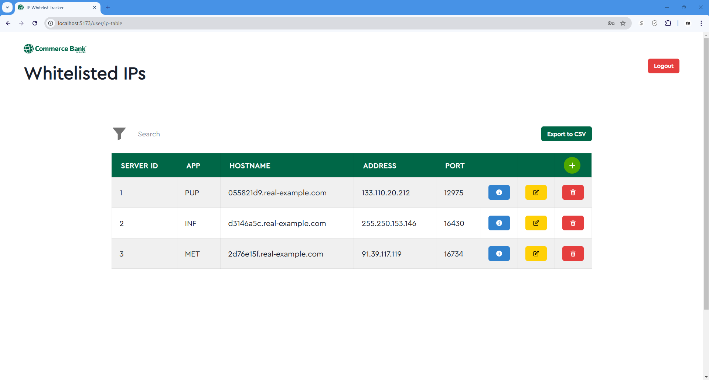
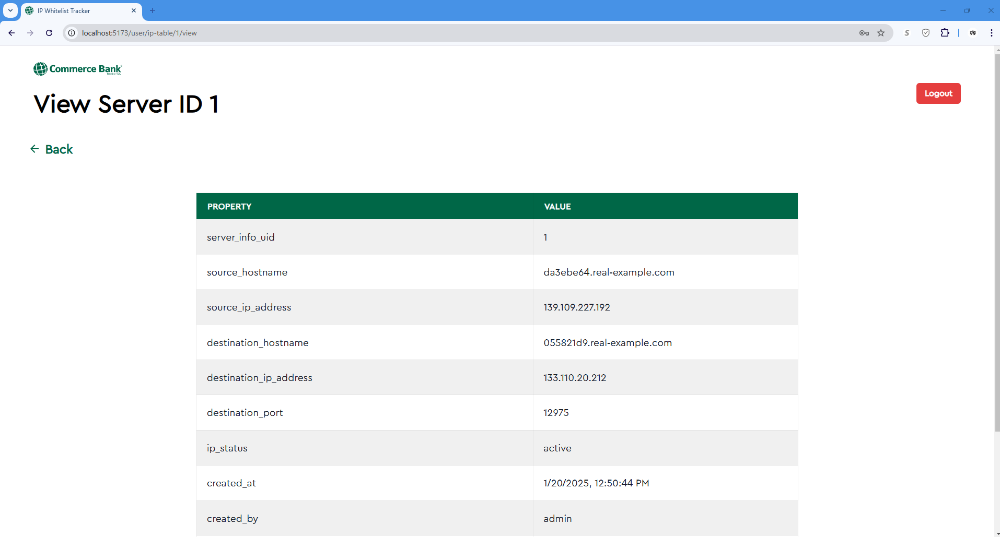
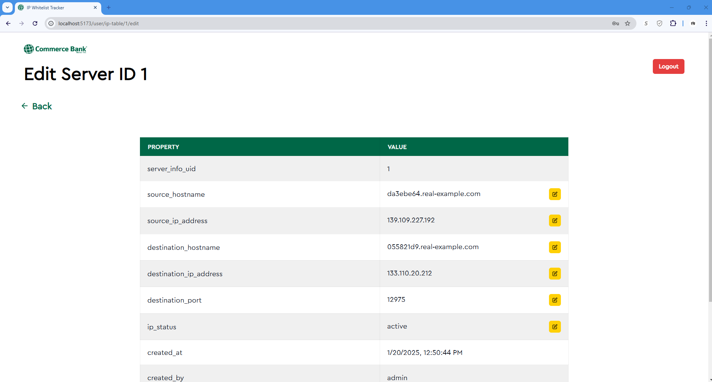
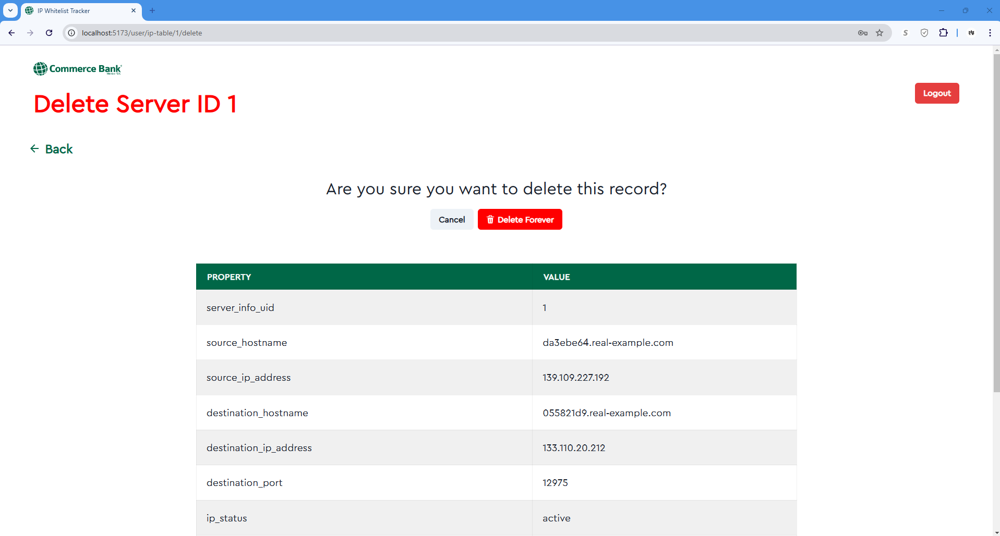
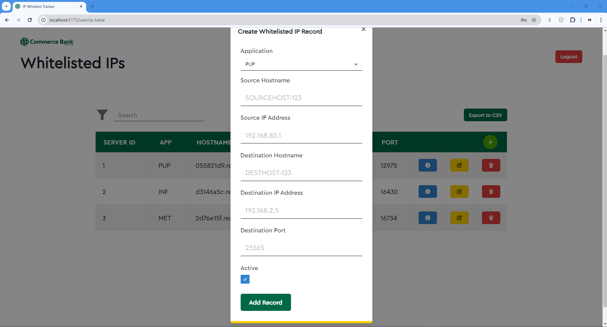

